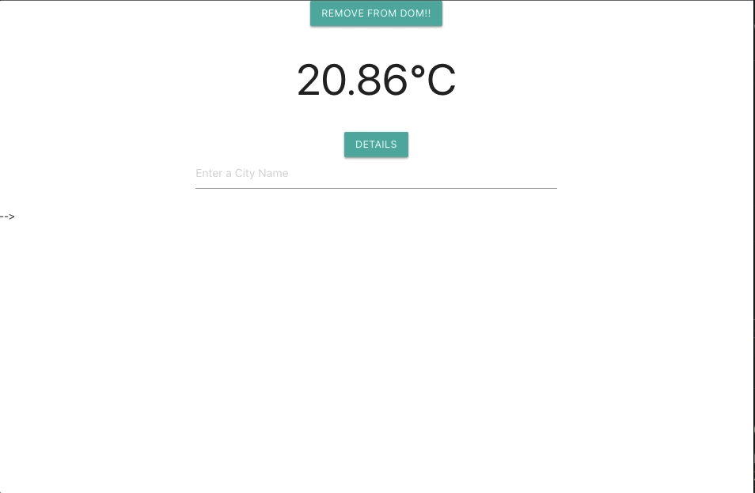

## About this project

This is simple weather app, build with React. Here I'm practicing class Components,Component Lifecycles - componentDidMount(), componentDidUpdate() and componentWillUnmount().
This is a self learning practice project and is not intended for presentation.

#### Features

- Search City - will display the current weather of that city.
- Modal will show max-min temperatures, description and icon.
- Remove from Dom will remove the modal (practice purpose)

#### Links

[Adding Lifecycle Methods to a Class](https://reactjs.org/docs/state-and-lifecycle.html#adding-lifecycle-methods-to-a-class)
